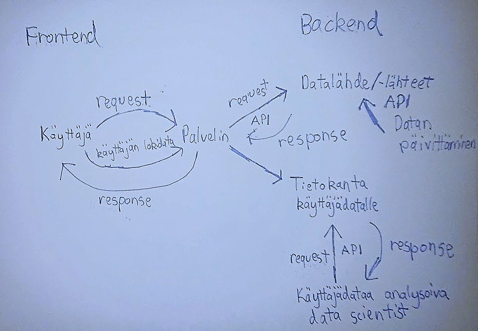

# Sovelluksen data-arkkitehtuuri

Keskeinen osa sovelluksen toimintaa on rajapinta, jonka kautta käyttäjä pystyy tekemään kyselyitä käytetyistä datalähteistä (lämpötila, hiilidioksidipäästöt, BKT). Riippuen itsenäisten datalähteiden määrästä voi olla, että rajapintoja tarvitaan useampi. Jotta sovellus pysyisi ajan tasalla täytyy datalähteisiin pystyä myös lisäämään dataa, mihin tarvitaan myös oma rajapintansa. 

Olettaen, että sovelluskehityksen osana halutaan analysoida käyttäjien tuottamaa lokidataa (esim. minkä maiden lämpenemisestä käyttäjät ovat erityisen kiinnostuneita, kuinka pitkään vierailu sovelluksessa keskimäärin kestää jne.), pitää tätä dataa kerätä tietokantaan. Aineiston hakemiseen tästä tietokannasta tarvitaan myös oma rajapintansa.  

Tekemäni mallinnuksen pitäisi olla melko vaivattomasti siirrettävissä backendiin.

